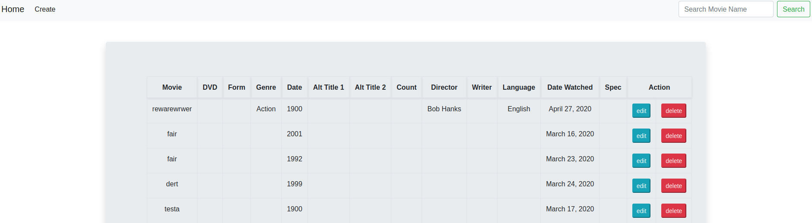

# MovieCrud
This was a request from a movie-loving friend who manually tracks their movie database in Excel. In trying to solve this problem, I learned what a CRUD system is and how to implement it using Django backend and Bootstrap frontend.



## Installation
```
1. Ensure Python 3 is installed
2. python3 -m virtualenv
3. Ensure to activate the virtualenv (source env/bin/activate)
4. pip install -r requirements.txt
5. This project was primarily run locally on a Google Chrome Browser. 
    * python3 manage.py makemigrations
    * python3 manage.py migrate
    * python3 manage.py runserver
```

## Usage example

MovieCrud has the capabilities of creating movie entries into the SQLite Database. Entries can be edited and deleted. A search feature is also available.

## Technologies
* Django 3
* Bootstrap 4
* Django Crispy Forms


## Release History

* 0.1.0
    * Initial release of project


## Meta

Distributed under the MIT license. See ``MIT`` for more information.
